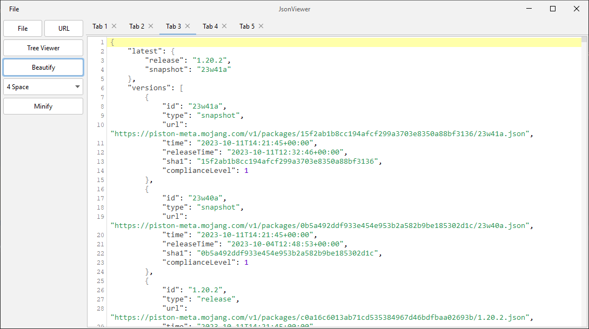

# JsonViewer
This is a simple local JSON viewer. It can load data from a URL or a File. Also, you can simply copy-paste JSON.



### Quick start:
First, make sure you have [Maven](https://maven.apache.org/) installed. To check it, run
```shell
mvn -v
```
If your Maven home and OS information is displayed, it means you have installed Maven correctly. Then run these commands:
```shell
git clone https://github.com/TheEntropyShard/JsonViewer
cd JsonViewer
mvn clean package
java -jar target/JsonViewer-0.4.3.jar
```