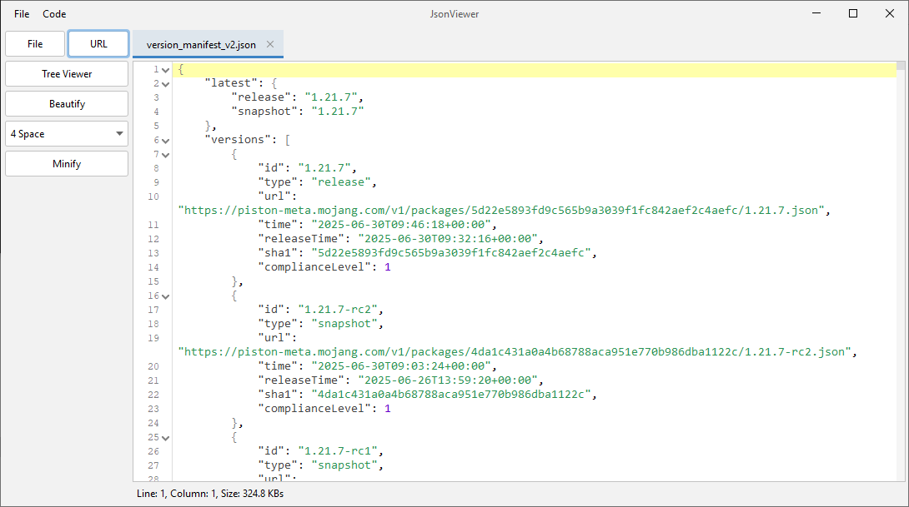
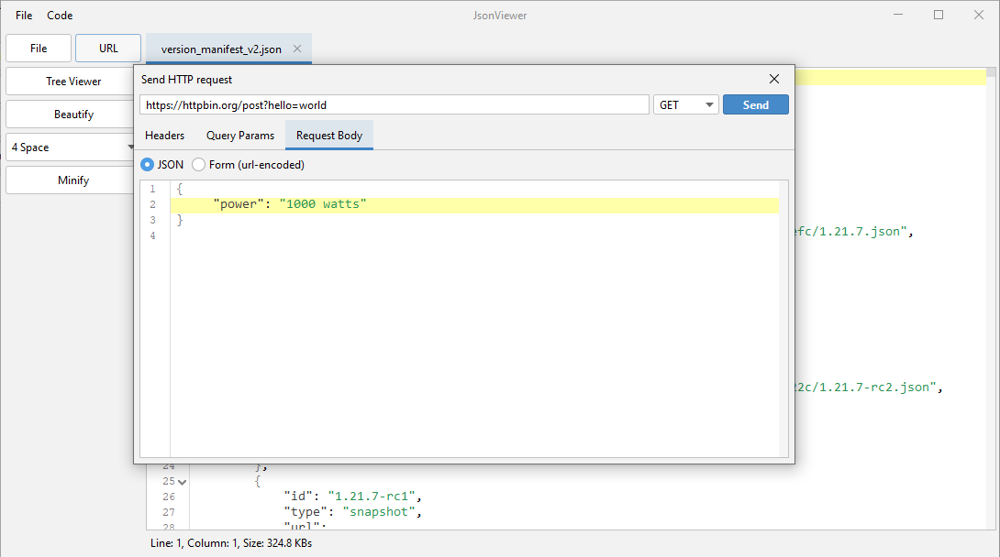

# JsonViewer
This is a simple local JSON viewer. It can load data from a URL or a File. Also, you can simply copy-paste JSON.

### Quick start:
To build JsonViewer you need JDK 17. Run these commands:
```shell
git clone https://github.com/TheEntropyShard/JsonViewer
cd JsonViewer
gradlew shadowJar
java -jar build/libs/JsonViewer-0.7.3.jar
```

### Screenshots






